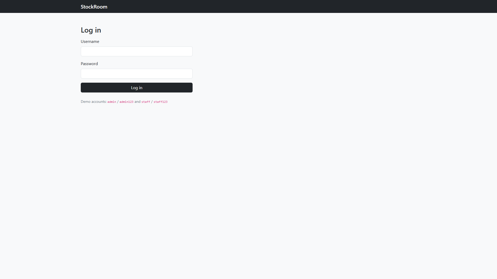
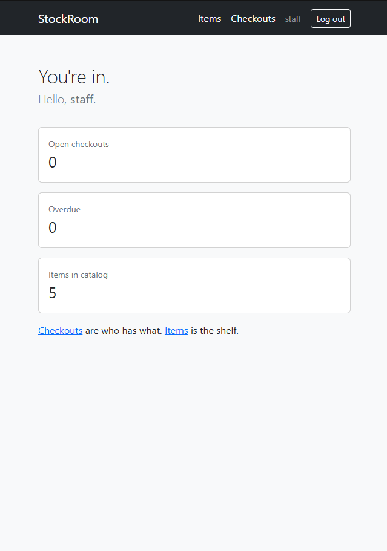
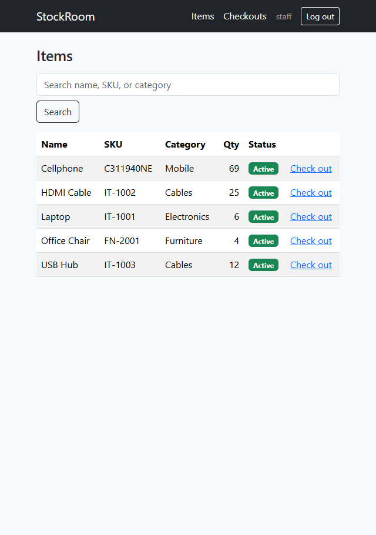
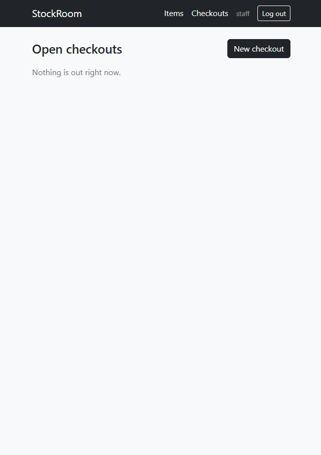
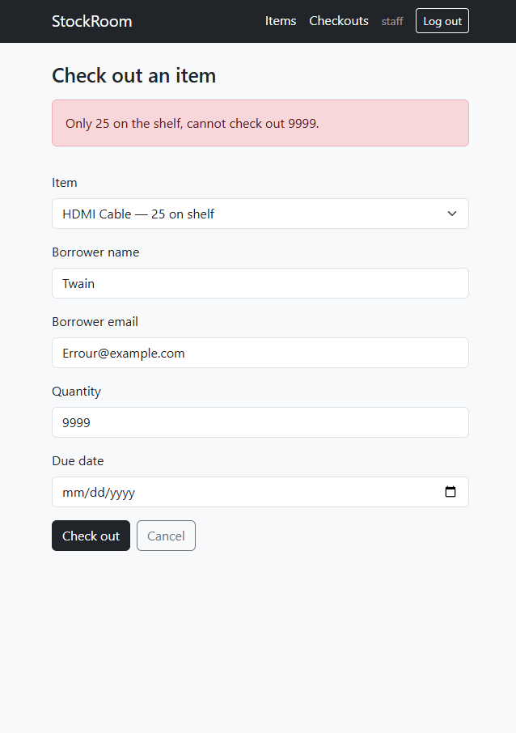

# StockRoom

Inventory and checkout for a small team (IT closet, lab, office equipment).

People take items off the shelf, they are due back on a date, and returning them puts stock back. **Admin** manages the catalog. **Staff** checks items in and out. The shelf quantity is the source of truth: you cannot check out more than is on hand.

Java full-stack portfolio project (Spring Boot + Thymeleaf).  
Repo: [github.com/cedrou1001-here/stockroom](https://github.com/cedrou1001-here/stockroom)

## Screenshots

Login:



Home (staff):



Items:



Open checkouts:



Trying to check out more than is on the shelf:



## Demo logins

Open [http://localhost:8080](http://localhost:8080) after the app starts.

| Username | Password | What they can do |
| --- | --- | --- |
| `admin` | `admin123` | Everything staff can do, plus add/edit items |
| `staff` | `staff123` | View items, check out, return |

Demo-only accounts. Do not reuse these passwords on a real public site.

## Run it (Windows)

Needs **Java 21**. From the project folder:

```powershell
.\mvnw.cmd spring-boot:run
```

Wait until the log says `Started StockRoomApplication`, then open [http://localhost:8080](http://localhost:8080).

Stop the app with **Ctrl+C** in that terminal.

You do not need to install Maven. `mvnw.cmd` (the Maven Wrapper) downloads it.

If `.\run.ps1` fails with “running scripts is disabled,” use `mvnw.cmd` as above.

Tests:

```powershell
.\mvnw.cmd test
```

GitHub also runs these tests on every push (see `.github/workflows/ci.yml`).

## What to click (2-minute walkthrough)

1. Log in as `staff`.
2. Home shows open checkouts, overdue loans, and how many items exist.
3. **Items** — catalog and quantities. Staff cannot add or edit.
4. **Checkouts** — who has what. Return puts stock back on the shelf.
5. Try checking out more units than quantity on hand. You should get an error, not a silent bad quantity.
6. Log out, log in as `admin`, add or edit an item.

## How the code is shaped

One app (not microservices). Packages:

| Package | Job |
| --- | --- |
| `domain` | Items, checkouts, users, stock rules |
| `service` | Checkout and catalog rules (`@Transactional` so stock and the loan stay in sync) |
| `web` | Pages (controllers + Thymeleaf templates) |
| `data` | Spring Data repositories (talk to the database) |
| `config` / `security` | Login, roles, password hashing |
| `db/migration` | Flyway SQL that creates tables |

Database today is **H2** (a file under `data/`). That is enough to learn and demo. PostgreSQL would be the usual next step for a production-like setup.

## Tech

- Java 21
- Spring Boot 4
- Spring Security (form login, `ADMIN` / `STAFF`)
- Spring Data JPA + Flyway
- Thymeleaf + Bootstrap 5
- JUnit (stock rules: cannot oversell, inactive items cannot go out)

## What I would add next

- PostgreSQL + Docker Compose
- Email reminders for overdue loans
- Audit log of who changed stock
- A REST API if a React UI were added later
